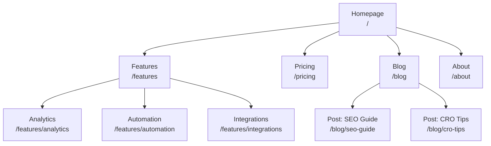
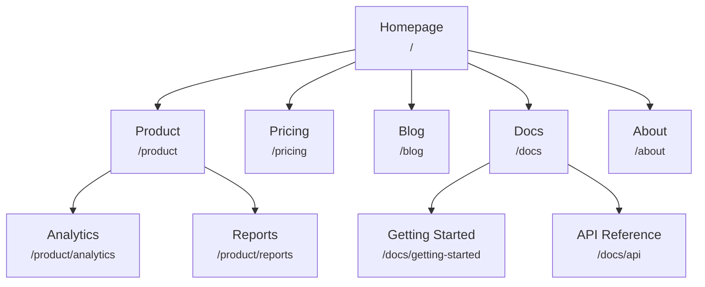
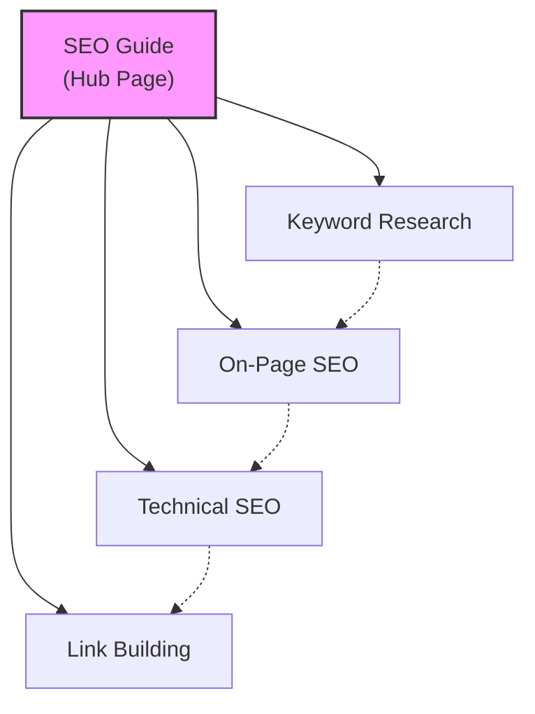
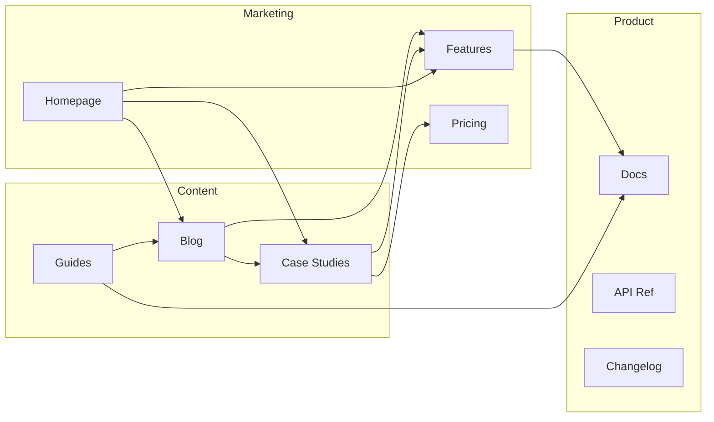
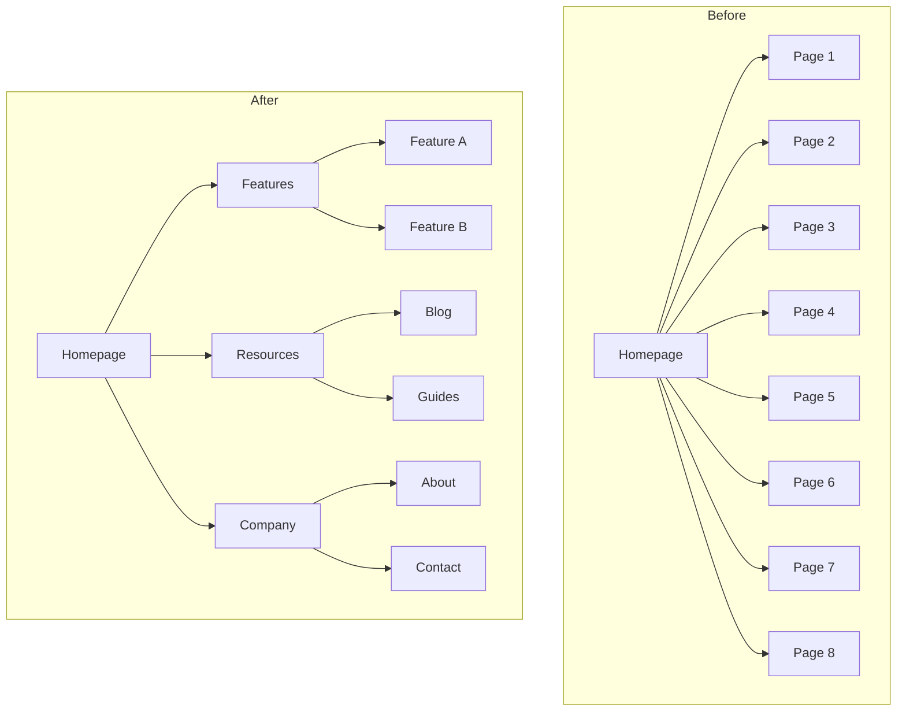
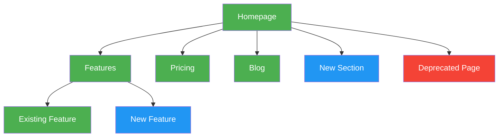

# Mermaid Diagram Templates

Copy-paste-ready Mermaid diagrams for visual sitemaps. Customize node labels and connections for your site.

---

## Basic Hierarchy

Simple top-down page hierarchy.

---

## Hierarchy with Navigation Zones

Uses subgraphs to show which pages appear in which navigation area.

```mermaid
graph TD
    subgraph "Header Nav"
        HOME["Homepage"]
        FEAT["Features"]
        PRICE["Pricing"]
        BLOG["Blog"]
        CTA["Get Started ★"]
    end

    subgraph "Feature Pages"
        F1["Analytics"]
        F2["Automation"]
        F3["Integrations"]
    end

    subgraph "Footer Nav"
        ABOUT["About"]
        CAREERS["Careers"]
        CONTACT["Contact"]
        PRIVACY["Privacy"]
        TERMS["Terms"]
    end

    HOME --> FEAT
    HOME --> PRICE
    HOME --> BLOG
    FEAT --> F1
    FEAT --> F2
    FEAT --> F3
    HOME --> ABOUT
    ABOUT --> CAREERS
    HOME --> CONTACT
```

---

## Hierarchy with URL Labels

Each node shows the page name and URL path.

---

## Hub-and-Spoke Content Model

Shows a hub page connected to spoke articles, with spokes linking to each other.

Legend:
- Solid lines = primary hub-spoke links
- Dashed lines = cross-links between spokes

---

## Internal Linking Flow

Shows how different site sections link to each other.

---

## Before/After Restructuring

Compare current and proposed site structures side by side.

---

## Color-Coding Conventions

Use styles to highlight page status, priority, or type.

Color key:
- **Green** (`#4CAF50`): Existing pages (no changes)
- **Blue** (`#2196F3`): New pages to create
- **Red** (`#f44336`): Pages to remove or redirect
- **Yellow** (`#FFC107`): Pages to restructure or move
- **Purple** (`#9C27B0`): High-priority / CTA pages
